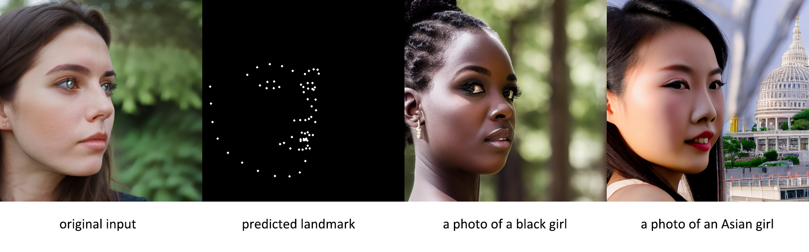
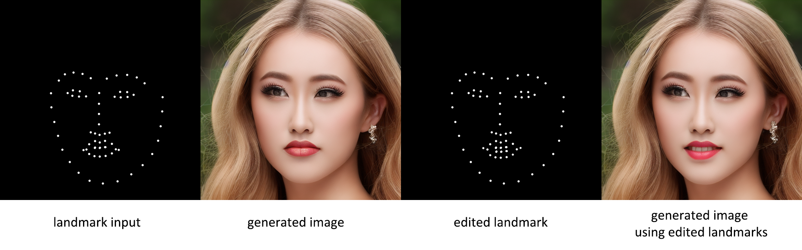

# Face landmark ControlNet

## ControlNet with Face landmark

I trained using [ControlNet](https://github.com/lllyasviel/ControlNet), which was proposed by lllyasviel, on a face dataset. By using facial landmarks as a condition, finer face control can be achieved.

Currently, I’m using Stable Diffusion 1.5 as the base model and dlib as the face landmark detector (those with the capability can replace it with a better one). The checkpoint will be released soon.

**Create conda environment:**

```sh
conda env create -f environment.yaml
conda activate control
wget http://dlib.net/files/shape_predictor_68_face_landmarks.dat.bz2
bzip2 -d shape_predictor_68_face_landmarks.dat.bz2
```

**Testing it by:**

```
python gradio_landmark2image.py
```

## Generate face with the identical poses and expression

To create a new face, input an image and extract the facial landmarks from it. These landmarks will be used as a reference to redraw the face while ensuring that the original features are retained.



## Control the facial expressions and poses of generated images

For the images we generated, we have the prompt and random seed used to generate them. While keeping the prompt and random seed, we can also edit the landmarks to modify the facial expressions and postures of the generated results.



## Credits

**Thanks to lllyasviel for his amazing work on [https://github.com/lllyasviel/ControlNet](https://github.com/lllyasviel/ControlNet)!, this is totaly based on his work.**

**This is just a proof of concept and should not be applied for any risky purposes.**

